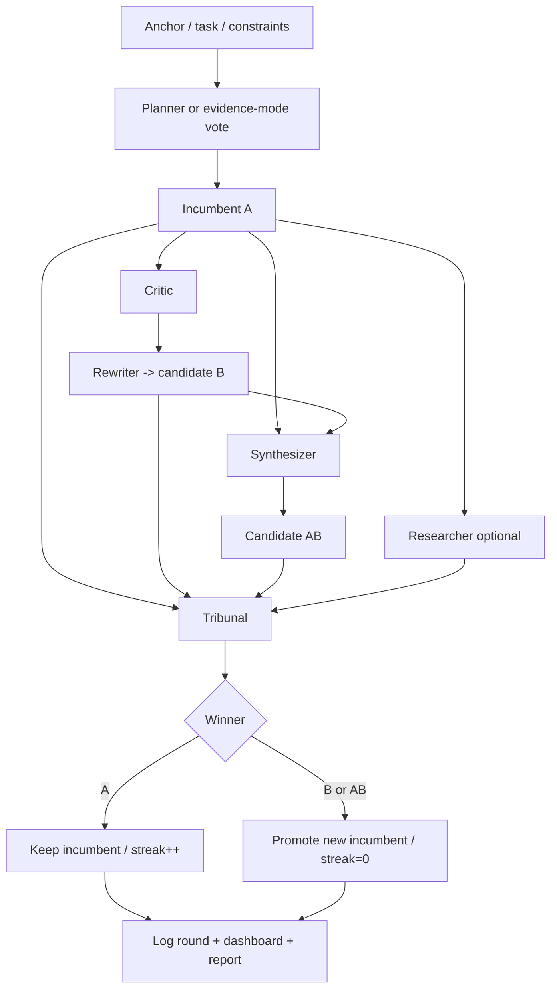

# AutoCatalyst Process Overview

```mermaid
flowchart TD
    A[Anchor / task / constraints] --> P[Planner or evidence-mode vote]
    P --> I[Incumbent A]
    I --> R[Researcher optional]
    I --> C[Critic]
    C --> B[Rewriter -> candidate B]
    I --> S[Synthesizer]
    B --> S
    S --> AB[Candidate AB]
    I --> T[Tribunal]
    B --> T
    AB --> T
    R --> T
    T --> W{Winner}
    W -->|A| K[Keep incumbent / streak++]
    W -->|B or AB| N[Promote new incumbent / streak=0]
    K --> L[Log round + dashboard + report]
    N --> L
```
