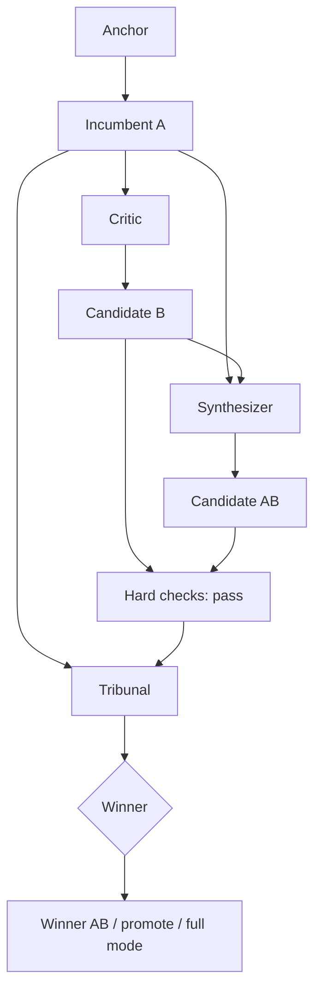

# Round 1 Flow

## Notes

- winner: AB
- status: promote
- hard checks: pass
- judge ranking: not logged
- degraded mode: no
- agents logged: not logged
- reason: AB combined broad operational coverage with strict gate/evidence discipline; all three judges ranked it first.
- artifacts:
  - autocatalyst-artifacts/rounds/round-1-casefile.md
  - autocatalyst-artifacts/rounds/round-1-planner-output.md
  - autocatalyst-artifacts/rounds/round-1-researcher-output.md
  - autocatalyst-artifacts/rounds/round-1-critic-output.md
  - autocatalyst-artifacts/rounds/round-1-judge-1.md
  - autocatalyst-artifacts/rounds/round-1-judge-2.md
  - autocatalyst-artifacts/rounds/round-1-judge-3.md
  - autocatalyst-artifacts/rounds/round-1-candidate-A.md
  - autocatalyst-artifacts/rounds/round-1-candidate-B.md
  - autocatalyst-artifacts/rounds/round-1-candidate-AB.md
  - docs/autonomous-trading-production-readiness-plan.md
  - autocatalyst-artifacts\rounds\round-1-tribunal-summary.json
