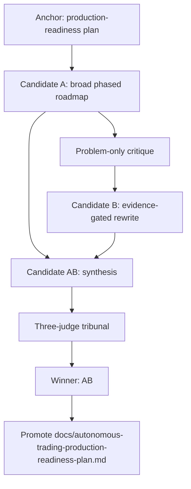

# Round 1 Flow

```mermaid
flowchart TD
  A["Anchor: production-readiness plan"] --> B["Candidate A: broad phased roadmap"]
  B --> C["Problem-only critique"]
  C --> D["Candidate B: evidence-gated rewrite"]
  B --> E["Candidate AB: synthesis"]
  D --> E
  E --> F["Three-judge tribunal"]
  F --> G["Winner: AB"]
  G --> H["Promote docs/autonomous-trading-production-readiness-plan.md"]
```
