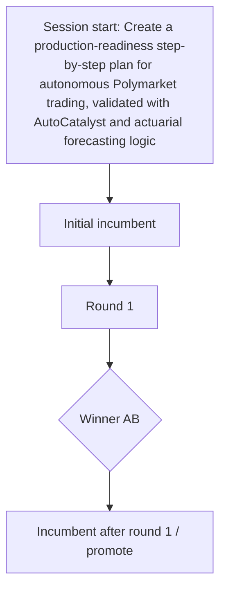

# Session History: Create a production-readiness step-by-step plan for autonomous Polymarket trading, validated with AutoCatalyst and actuarial forecasting logic

## Round outcomes

- Round 1: winner=AB status=promote — AB combined broad operational coverage with strict gate/evidence discipline; all three judges ranked it first.
